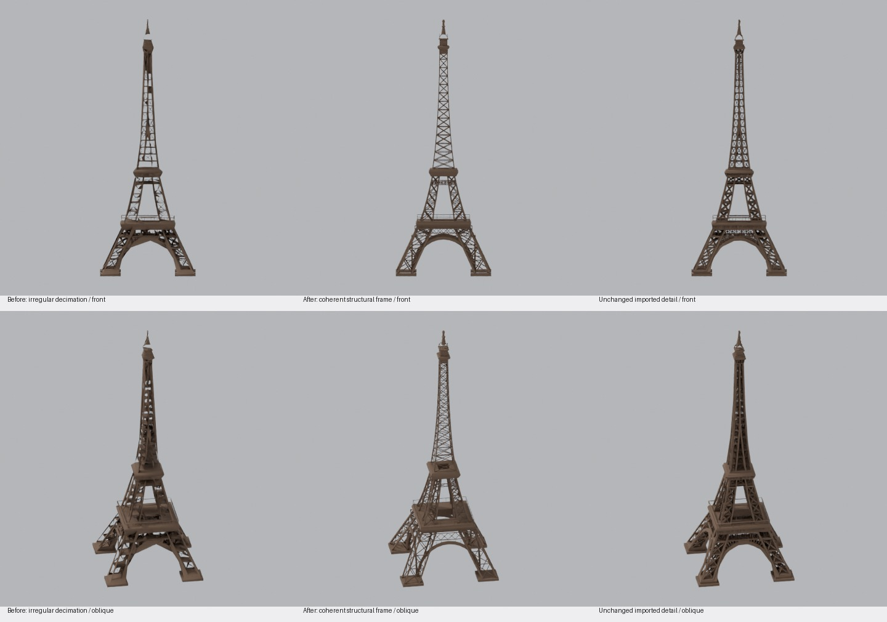

# Eiffel Tower low-detail refinement — 2026-10-08

The previous whole-mesh simplification deleted braces and produced irregular sheets. This replacement reconstructs a coherent low-detail frame from measured sections and elevations of [Newcandle's credited Commons STL](https://commons.wikimedia.org/wiki/File:EiffelTower_fixed.stl).

The replacement has continuous chords, full X braces on the outward-facing pier surfaces, a single diagonal on each inward-facing pier surface, regular shaft panels, continuous curved arch girders, open first-floor railings, and a simplified summit. Secondary lacing, decorative arcades and internal lift structures are omitted. The source's printed proportions and stepped platforms are approximated; this is an artistic adaptation, not a survey.

- Low GLB: **7,284 triangles; 235,392 raw bytes** (previously 5,791 triangles; 202,584 bytes). The contract permits 8,000 triangles / 250,000 bytes.
- One palette material; two triangle draw calls; no textures or mesh decoder.
- glTF validation: zero errors and warnings. Both primitives have zero degenerate or duplicate triangles, reversed normals and non-manifold edges.
- The triangular braces have deliberately open ends buried in their chords: 3,864 boundary edges. Chords, platforms and arch strips are closed.
- The detailed GLB remains exactly `3a1a8469ed272c619f3ef9b0815483c4ff6986b57a8169dec3e611814d941160`.
- The original spatial extract, preview, material, anchor, orientation, base extent and 330 m height are retained. Both LODs fit the same declared envelope. Basemap replacement and culling metadata are retained.
- The editable scene contains the complete credited imported mesh (hidden) and the two editable low-detail batches. The grant remains **CC BY-SA 3.0**, with Newcandle's credit and original-file checksum preserved; modification notices describe this rebuild.
- Inspected front, oblique and side renders. Human appearance and map-integration review are pending for this new exact revision.

New low GLB SHA-256: `2968a4c8336f086467f347d913b88920e73e53b89131bfe1dda33bb8752cfe0f`.

Content revision: `81d5d599907a6a86711088193f0ea7ef4948fa993448b05a0a685c76263a53ae`.

The contribution is pending review. The approved channel continues serving the previous approved revision; no publication records are changed in this proposal.
